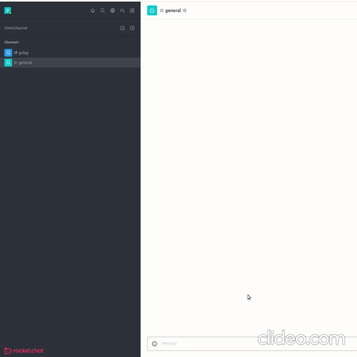

# Gulag Bot
Sends people to the gulag in Rocket Chat, using the [Rocket.Chat JS SDK](https://github.com/RocketChat/Rocket.Chat.js.SDK).


## Getting Started

### 1. Download the code


First, clone the repository and then `cd` into the directory.

### 2. Setup the packages and environment

Once in the `gulagbot` directory, you'll have to install the dependencies with the command

```
npm install
```

and you will also want to create a `.env` file with the variables needed to login to the bot.

```
touch .env
```

### 3. Create a bot user in your Rocket.Chat

You'll want to create a new bot user with the permissions of `bot` and `moderator`. The bot will not be allowed to add/remove users from 
channels without these permissions.


You'll also want to make sure your Rocket.Chat has 2 rooms called `gulag` and `general` (case sensitive), and that the bot is inside that channel. 
You can modify the `ROOMS` variable to include more rooms that the bot can be included in. The more channels the bot is in,
the more channels you can use to send someone to the Gulag.


### 4. The `.env` file

Since we don't want to push the bot's credentials to version control, we want to store it in the environment. This is 
what a sample `.env` file would look like for this code.

```
ROCKETCHAT_URL=http://127.0.0.1:80
ROCKETCHAT_USER=GulagBot
ROCKETCHAT_PASSWORD=password
TIMEOUT=60000
USESLL=false
```

Of course, you'll fill in the credentials that you used to create the bot in step 3 with `ROCKETCHAT_URL` being the host of your Rocket.Chat server,
`ROCKETCHAT_USER` being the username of the bot created in step 3, and `ROCKETCHAT_PASSWORD` being the password of the bot created in step 3.

The reference for this is [at this link](https://github.com/RocketChat/Rocket.Chat.js.SDK#settings).

If you are using this for a production server, **PLEASE MAKE SURE YOU ARE USING HTTPS AND SSL.**


### 5. Run the bot

Simply run the command 
```
node gulagbot.js
```

### 6. Send someone to the Gulag

All you have to do is be an Admin & mention someone with the prefix `!gulag`.

If we had a user with the username `badman`, all we would have to do is type

```
!gulag @badman
```

and then bot will take care of the rest.

The bot will automatically take people out of the Gulag at the end of the specified `TIMEOUT` environment variable.


### The bot in action.



